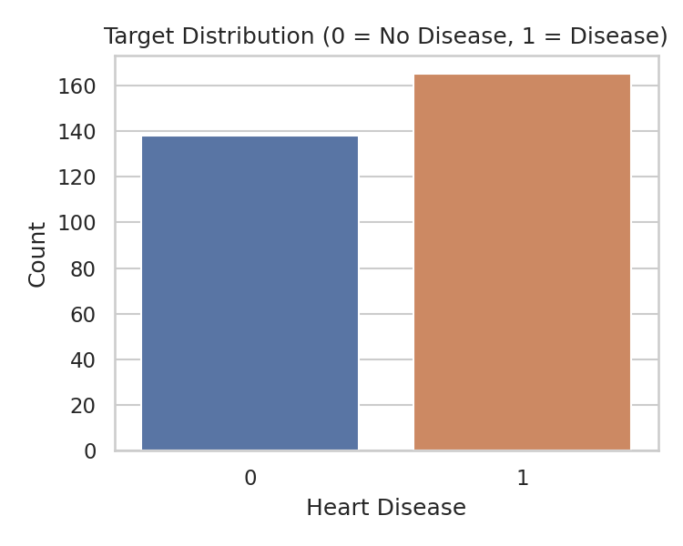
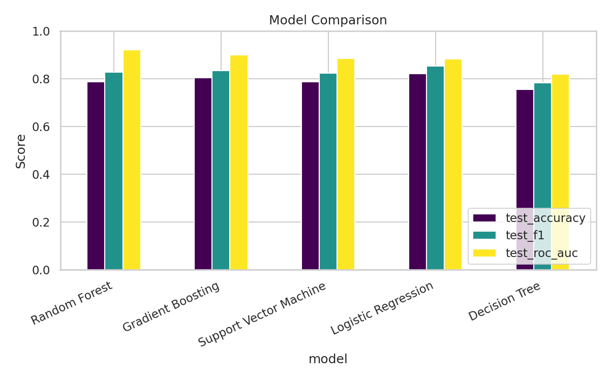

# ❤️ Heart Disease Prediction — End-to-End Machine Learning Project

[](https://www.python.org/)
[](https://scikit-learn.org/)
[](https://streamlit.io/)
[](LICENSE)

> A production-style machine learning project that predicts the likelihood
> of heart disease from 13 clinical attributes, with a live interactive
> web app for real-time predictions.

🔗 **Live Demo:** `https://YOUR-APP-NAME.streamlit.app` — *update this link after deployment (steps below)*
📁 **Dataset:** [UCI Cleveland Heart Disease Dataset](https://archive.ics.uci.edu/dataset/45/heart+disease) (303 patients, 13 features)

---

## 📌 Project Overview

Cardiovascular disease is one of the leading causes of death worldwide.
This project builds a full ML pipeline — from raw data to a deployed web
app — that estimates a patient's risk of heart disease based on clinical
measurements such as age, cholesterol, blood pressure, chest pain type,
and ECG results.

This is **not a toy notebook**. It follows a structure you'd expect in an
actual data analyst / data science role:

- Reproducible data pipeline (`train_model.py`)
- Multiple models trained & compared, not just one
- Hyperparameter tuning with cross-validation
- Proper evaluation (accuracy, precision, recall, F1, ROC-AUC, confusion matrix)
- Saved, versioned model artifacts (`models/`)
- A polished, interactive **Streamlit** front end anyone can try live
- Clean repo structure that's easy for a recruiter/interviewer to navigate

---

## 🖼️ Screenshots

| Prediction Page | Model Performance Dashboard |
|---|---|
|  |  |

*(Screenshots above are placeholders from the EDA — replace with actual app
screenshots after you run it locally, see instructions below.)*

---

## 🧠 Problem Statement

**Given** a patient's clinical measurements, **predict** whether they are
likely to have heart disease (binary classification: 0 = no disease,
1 = disease present).

### Features used

| Feature | Description |
|---|---|
| `age` | Age in years |
| `sex` | Sex (1 = male, 0 = female) |
| `cp` | Chest pain type (0–3) |
| `trestbps` | Resting blood pressure (mm Hg) |
| `chol` | Serum cholesterol (mg/dl) |
| `fbs` | Fasting blood sugar > 120 mg/dl |
| `restecg` | Resting ECG results (0–2) |
| `thalach` | Maximum heart rate achieved |
| `exang` | Exercise-induced angina |
| `oldpeak` | ST depression induced by exercise |
| `slope` | Slope of the peak exercise ST segment |
| `ca` | Number of major vessels colored by fluoroscopy |
| `thal` | Thalassemia type |

---

## 🏗️ Project Structure

```
heart-disease-prediction/
├── app.py                     # Streamlit web app (live demo)
├── train_model.py             # Full training + evaluation pipeline
├── requirements.txt           # Python dependencies
├── data/
│   └── heart.csv              # UCI Heart Disease dataset
├── models/
│   ├── heart_disease_model.pkl   # Trained best model (pipeline)
│   ├── feature_columns.pkl       # Feature order used at inference
│   └── metadata.json             # Metrics + model metadata
├── images/                    # EDA plots & evaluation charts
├── .streamlit/
│   └── config.toml            # App theme config
└── README.md
```

---

## ⚙️ How It Works

1. **`train_model.py`** loads the dataset, runs EDA (saving plots to
   `images/`), then trains **five different algorithms**:
   - Logistic Regression
   - Random Forest
   - Gradient Boosting
   - Support Vector Machine
   - Decision Tree

   Each is tuned with `GridSearchCV` over a 5-fold stratified cross-validation,
   optimizing for ROC-AUC. The best model (by test ROC-AUC) is saved to
   `models/heart_disease_model.pkl`.

2. **`app.py`** loads that saved model and exposes:
   - A **Predict** page — enter patient vitals, get an instant risk score with a gauge visualization
   - A **Model Performance** page — comparison table + charts across all 5 models
   - An **About** page — project write-up for reviewers

### Results (on held-out 20% test set)

| Model | CV ROC-AUC | Accuracy | Precision | Recall | F1 | ROC-AUC |
|---|---|---|---|---|---|---|
| **Random Forest** ✅ | 0.891 | 0.787 | 0.738 | 0.939 | 0.827 | **0.921** |
| Gradient Boosting | 0.878 | 0.803 | 0.769 | 0.909 | 0.833 | 0.899 |
| SVM (linear) | 0.894 | 0.787 | 0.750 | 0.909 | 0.822 | 0.884 |
| Logistic Regression | 0.892 | 0.820 | 0.762 | 0.970 | 0.853 | 0.882 |
| Decision Tree | 0.810 | 0.754 | 0.750 | 0.818 | 0.783 | 0.818 |

Random Forest was selected as the deployed model based on the highest
test ROC-AUC score.

---

## 🚀 Run Locally

```bash
# 1. Clone the repo
git clone https://github.com/YOUR_USERNAME/heart-disease-prediction.git
cd heart-disease-prediction

# 2. Create a virtual environment (recommended)
python -m venv venv
source venv/bin/activate      # On Windows: venv\Scripts\activate

# 3. Install dependencies
pip install -r requirements.txt

# 4. (Optional) Retrain the model from scratch
python train_model.py

# 5. Launch the app
streamlit run app.py
```

The app will open at `http://localhost:8501`.

---

## ☁️ Deploy Your Own Live Demo (Free — Streamlit Community Cloud)

This is the part that makes the project resume-ready with a clickable
live link.

1. Push this project to a **public GitHub repository**.
2. Go to [share.streamlit.io](https://share.streamlit.io) and sign in with GitHub.
3. Click **"New app"** → select your repo → branch `main` → main file path `app.py`.
4. Click **Deploy**. In ~2 minutes you'll get a public URL like:
   `https://your-username-heart-disease-prediction.streamlit.app`
5. Add that URL to the top of this README and to your resume/LinkedIn/Naukri profile.

> Alternative free hosts: [Hugging Face Spaces](https://huggingface.co/spaces) (Streamlit SDK) or [Render](https://render.com).

---

## 🛠️ Tech Stack

- **Language:** Python 3.10+
- **ML:** scikit-learn (Pipelines, GridSearchCV, StratifiedKFold)
- **Data:** pandas, NumPy
- **Visualization:** matplotlib, seaborn, Plotly
- **Web App / Deployment:** Streamlit, Streamlit Community Cloud
- **Version Control:** Git & GitHub

---

## 📈 Possible Extensions (good talking points in interviews)

- Add SHAP/LIME for model explainability (which features drove a given prediction)
- Add a REST API (FastAPI) in front of the model for programmatic access
- Containerize with Docker for reproducible deployment
- Add unit tests (pytest) for the preprocessing & prediction functions
- Set up a CI/CD pipeline (GitHub Actions) to retrain/redeploy on new data

---

## ⚕️ Disclaimer

This project is for **educational and portfolio purposes only**. It is
**not a certified medical tool** and must not be used for real clinical
decisions. Always consult a qualified healthcare professional.

---

## 👤 Author

**Your Name**
[LinkedIn](https://linkedin.com/in/your-profile) · [GitHub](https://github.com/YOUR_USERNAME) · [Email](mailto:you@example.com)

If this project helped you, consider ⭐ starring the repo!
